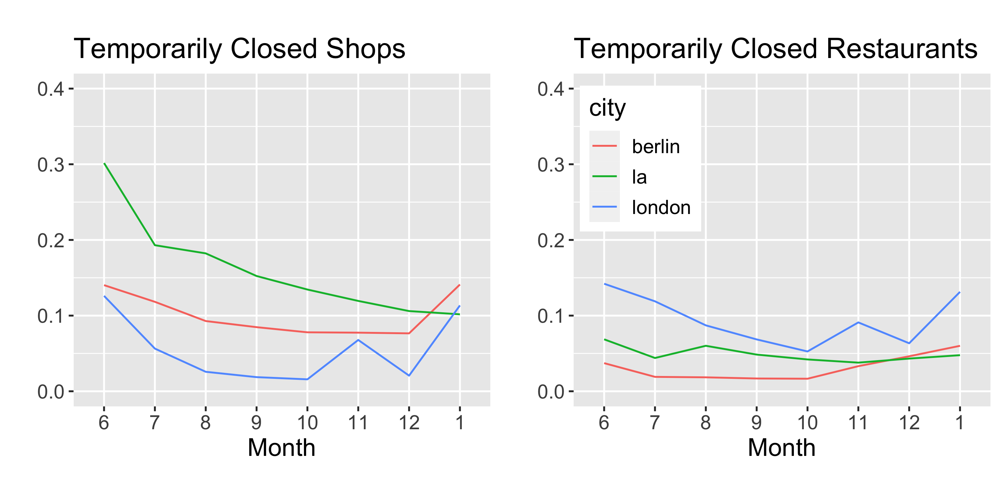
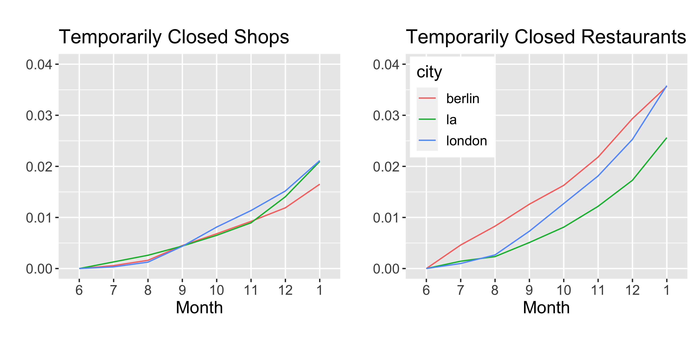
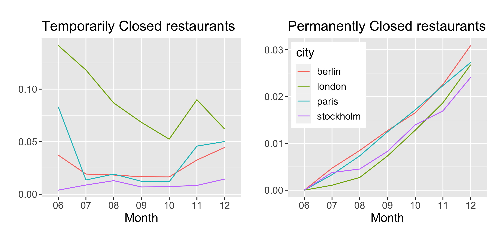
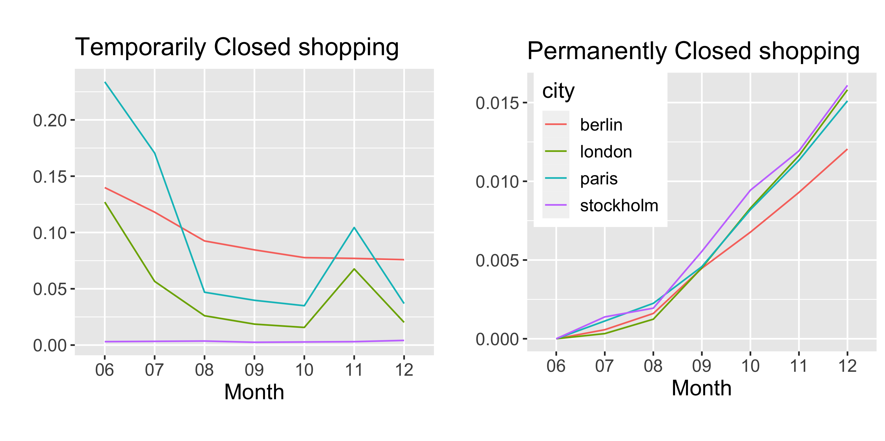

## Closures of Shops and Restaurants during the Corona Virus Pandemic

This project aims to document the temporary and permanent closures of shops and restaurants over the course of the Corona virus pandemic.
To do so we are collecting data from major cities in Europe and in the US.

As the following graph shows, temporary closures track the respective lockdowns well, coming down over the summer and into fall but then going back up in the winter. In London one can see the November and January lockdowns with a pause in December, in Germany shops were ordered to close
only a few days before Christmas, which we capture in our data only in January.

The graph shows the share of shops and restaurants that are temporarily closed in any given month.

We also detect permanent closures, which by definition continue to track higher over time.
The graph shows again the share of shops and restaurants that are permanently closed in any given month.

## Explore more cities here:

<iframe scrolling="no" frameborder="no" src="https://wolfgangrid.shinyapps.io/high-street-app/" class="l-screen-inset shaded" style="width:800px;height: 100vh;"></iframe>

## Locations of Closures in London:

We also observe the location of shops and restaurants, allowing us to see where in each city
closures have been concentrated. As the map below for London shows, temporary closures,
especially of restaurants, have been concentrated in the centre of the city.
This is less the case for permanent closures.

<iframe scrolling="no" frameborder="no" src="https://wolfgangrid.shinyapps.io/high-street-app-maps/" class="l-screen-inset shaded" style="width:800px;height: 100vh;"></iframe>

## Some observations:

Shops shut temporarily at a higher rate during the different lockdowns than restaurants did but permanent closures have affected restaurants at higher rates:

The relative number of temporary closures and permanent closures may be quite different within a city. Stockholm had much fewer temporary closures than other European capitals but a comparable rate of permanent closures.

